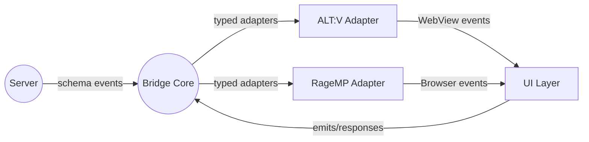

# Architecture Overview

## Goals

- Deliver a single front-end bridge consumable by ALT:V and RageMP environments.
- Guarantee type-safe messaging between server ↔ UI ↔ client layers with shared schemas.
- Auto-generate human-friendly documentation and developer tooling from the same source of truth.

## High-Level Components

1. **Core Protocol (`@altrage/bridge-core`)**
   - Schema registry (events, payload contracts, validation rules).
   - Serialization utilities and platform-agnostic transport helpers.
   - Tooling for code generation (TypeScript types, runtime validators, documentation models).

2. **Platform Adapters**
   - `adapter-altv`: Wraps `alt.emit/alt.on`, normalises signatures, handles RPC correlations.
   - `adapter-ragemp`: Wraps `mp.trigger` / `mp.events.add`, aligns with the shared schema.
   - Both adapters expose an identical API surface mirroring the contracts defined in core.

3. **Documentation Portal (`apps/docs`)**
   - Swagger-like explorer generated from schema metadata.
   - Shows event direction (server → UI, UI → client, etc.), payload structure, examples, and error cases.

4. **Playground (`apps/playground`)**
   - Dev sandbox for mocking ALT:V/RageMP behaviours in the browser.
   - Provides overlay debugging panel, timeline inspector, and stress-testing scenarios.

## Data Flow

## Non-Goals

- Implementing actual game UI components (handled by downstream feature teams).
- Managing server-side state machines (bridge focuses on transport & typing).
- Providing low-level ALT:V or RageMP server bindings beyond event bridging.

## Next Steps

- Define schema DSL (`.schema.ts` or `.json`) with metadata for docs and runtime.
- Prototype code generation pipeline for typed emits/calls.
- Integrate doc portal with schema outputs (Markdown + JSON for UI rendering).
